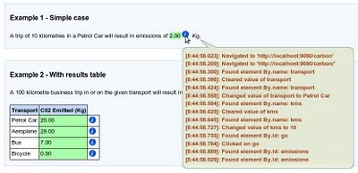

[](https://travis-ci.org/concordion/concordion-logging-tooltip-extension)

This [Concordion](http://www.concordion.org) extension adds logging information unobtrusively to the Concordion output. The logging information is only displayed when hovering over the tooltip.

The [demo project](http://github.com/concordion//concordion-logging-tooltip-extension-demo) demonstrates this extension.

# Introduction

This extension allows us to reveal implementation details in the Concordion output, without obscuring the intent of the specification. For example:



Revealing the implementation detail can help to improve the level of trust in the tests, and sometimes highlights redundant steps in the tests. This is discussed further in [this blog entry](http://tutansblog.blogspot.com/2010/09/whats-happening-in-my-acceptance-tests.html).

The extension captures the logging information from java.util.logging.

## Default Configuration

By default, this extension will capture all output from the root logger and disable console logging of the root logger.

To install the extension with default configuration, either annotate the fixture class with:

```java
    @Extensions(LoggingTooltipExtension.class)
```

or set the system property `concordion.extensions` to `org.concordion.ext.LoggingTooltipExtension`.

## Custom Configuration

The extension can be customised to restrict the log output to named loggers, and by logging level. The output of logging to the console can also be enabled.

The easiest way is to use the `@Extension` annotation on a [LoggingTooltipExtension](https://github.com/concordion/concordion-extensions/blob/master/src/main/java/org/concordion/ext/LoggingTooltipExtension.java) instance field within the fixture class. For example:

```java
        String loggers = "carbon.CarbonCalculatorTest, selenium.events";
        @Extension
        public ConcordionExtension extension =
            new LoggingTooltipExtension(loggers, Level.FINE, false);
```

## Using other loggers

For those not using java.util.logging, a custom LogMessenger can be provided. See the test class [AlternateLoggingTooltipExtensionFactory](https://github.com/concordion/concordion-extensions/blob/master/src/test/java/spec/concordion/ext/loggingTooltip/AlternateLoggingTooltipExtensionFactory.java) for a basic example.

# Further info

* [Specification](http://concordion.github.io/concordion-logging-tooltip-extension/spec/spec/concordion/ext/loggingTooltip/LoggingTooltip.html)
* [API](http://concordion.github.io/concordion-logging-tooltip-extension/api/index.html)
* [Demo project](http://github.com/concordion/concordion-logging-tooltip-extension-demo)

### Acknowledgements

Thanks to Trent Richardson for the [CSS Tooltip](http://trentrichardson.com/examples/csstooltips/) implementation.